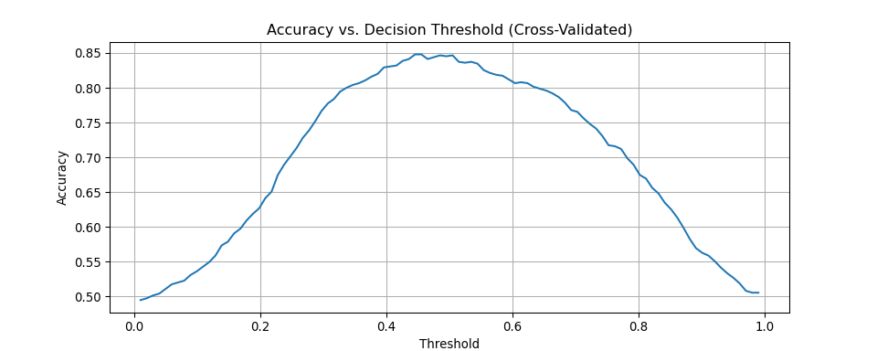

<!-- README.md is generated from README.Rmd. Please edit that file -->

# asgl </a>

[](https://pepy.tech/project/asgl)
[](https://pepy.tech/project/asgl)
[](https://www.gnu.org/licenses/gpl-3.0)
[](https://cran.r-project.org/package=asgl)

## Introduction

The `asgl` package is a versatile and robust tool designed for fitting a
variety of regression models, including linear regression, quantile
regression, logistic regression and various penalized regression models
such as Lasso, Ridge, Group Lasso, Sparse Group Lasso, and their
adaptive variants. The package is especially useful for simultaneous
variable selection and prediction in both low and high-dimensional
frameworks.

The primary class available to users is the `Regressor` class, which is
detailed later in this document.

`asgl` is based on cutting-edge research and methodologies, as outlined
in the following papers:

- [Adaptive Sparse Group Lasso in Quantile
  Regression](https://link.springer.com/article/10.1007/s11634-020-00413-8)
- [`asgl`: A Python Package for Penalized Linear and Quantile
  Regression](https://arxiv.org/abs/2111.00472)

For a practical introduction to the package, users can refer to the user
guide notebook available in the GitHub repository. Additional accessible
explanations can be found on [Towards Data Science: Sparse Group
Lasso](https://towardsdatascience.com/sparse-group-lasso-in-python-255e379ab892),
[Towards Data Science: Adaptive
Lasso](https://towardsdatascience.com/an-adaptive-lasso-63afca54b80d)
and [Towards Data Science: Quantile
regression](https://towardsdatascience.com/squashing-the-average-a-dive-into-penalized-quantile-regression-for-python-8f3a996768b6).

## Dependencies

asgl requires:

- Python \>= 3.9
- cvxpy \>= 1.2.0
- numpy \>= 1.20.0
- scikit-learn \>= 1.0
- scipy \>= 1.1
- pytest \>= 7.1.2

## User installation and testing

The easiest way to install asgl is using `pip`:

    pip install asgl

After installation, you can launch the test suite from the source
directory (you will need to have `pytest >= 7.1.2` installed) by runnig:

    pytest

## Key features:

The `Regressor` class includes the following list of parameters:

- model: str, default=‘lm’
  - Type of model to fit. Options are ‘lm’ (linear regression), ‘qr’
    (quantile regression), ‘logit’ (logistic regression for binary
    classification, output binary classification), ‘logit_proba’
    (logistic regression for binary classification, output probability)
    and ‘logit_raw’ (logistic regression for binary classification,
    output score before logistic).
- penalization: str or None, default=‘lasso’
  - Type of penalization to use. Options are ‘lasso’, ‘ridge’, ‘gl’
    (group lasso), ‘sgl’ (sparse group lasso), ‘alasso’ (adaptive
    lasso), ‘aridge’, ‘agl’ (adaptive group lasso), ‘asgl’ (adaptive
    sparse group lasso), or None.
- quantile: float, default=0.5
  - Quantile level for quantile regression models. Valid values are
    between 0 and 1.
- fit_intercept: bool, default=True
  - Whether to fit an intercept in the model.
- lambda1: float, default=0.1
  - Constant that multiplies the penalization, controlling the strength.
    Must be a non-negative float i.e. in `[0, inf)`. Larger values will
    result in larger penalizations.
- alpha: float, default=0.5
  - Constant that performs tradeoff between individual and group
    penalizations in sgl and asgl penalizations. `alpha=1` enforces a
    lasso penalization while `alpha=0` enforces a group lasso
    penalization.
- solver: str, default=‘default’
  - Solver to be used by `cvxpy`. Default uses optimal alternative
    depending on the problem. Users can check available solvers via the
    command `cvxpy.installed_solvers()`.
- weight_technique: str, default=‘pca_pct’
  - Technique used to fit adaptive weights. Options include ‘pca_1’,
    ‘pca_pct’, ‘pls_1’, ‘pls_pct’, ‘lasso’, ‘ridge’, ‘unpenalized’, and
    ‘sparse_pca’. For low dimensional problems (where the number of
    variables is smaller than the number of observations) the usage of
    the ‘unpenalized’ or ‘ridge’ weight_techniques is encouraged. For
    high dimensional problems (where the number of variables is larger
    than the number of observations) the default ‘pca_pct’ is
    encouraged.
- individual_power_weight: float, default=1
  - Power to which individual weights are raised. This parameter only
    has effect in adaptive penalizations. (‘alasso’ and ‘asgl’).
- group_power_weight: float, default=1
  - Power to which group weights are raised. This parameter only has
    effect in adaptive penalizations with a grouped structure (‘agl’ and
    ‘asgl’).
- variability_pct: float, default=0.9
  - Percentage of variability explained by PCA, PLS, and sparse PCA
    components. This parameter only has effect in adaptiv penalizations
    where `weight_technique` is equal to ‘pca_pct’, ‘pls_pct’ or
    ‘sparse_pca’.
- lambda1_weights: float, default=0.1
  - The value of the parameter `lambda1` used to solve the lasso model
    if `weight_technique='lasso'`
- spca_alpha: float, default=1e-5
  - Sparse PCA parameter. This parameter only has effect if
    `weight_technique='sparse_pca'`See scikit-learn implementation for
    more details.
- spca_ridge_alpha: float, default=1e-2
  - Sparse PCA parameter. This parameter only has effect if
    `weight_technique='sparse_pca'`See scikit-learn implementation for
    more details.
- individual_weights: array or None, default=None
  - Custom individual weights for adaptive penalizations. If this
    parameter is informed, it overrides the weight estimation process
    defined by parameter `weight_technique` and allows the user to
    provide custom weights. It must be either `None` or be an array with
    non-negative float values and length equal to the number of
    variables.
- group_weights: array or None, default=None
  - Custom group weights for adaptive penalizations. If this parameter
    is informed, it overrides the weight estimation process defined by
    parameter `weight_technique` and allows the user to provide custom
    weights. It must be either `None` or be an array with non-negative
    float values and length equal to the number of groups (as defined by
    `group_index`)
- tol: float, default=1e-4
  - Tolerance for coefficients to be considered zero.
- weight_tol: float, default=1e-4
  - Tolerance value used to avoid ZeroDivision errors when computing the
    weights.

## Examples

### Example 1: Linear Regression with Lasso.

``` python
from sklearn.datasets import make_regression
from sklearn.model_selection import train_test_split
from sklearn.metrics import mean_squared_error
from asgl import Regressor

X, y = make_regression(n_samples=1000, n_features=50, n_informative=25, bias=10, noise=5, random_state=42)
X_train, X_test, y_train, y_test = train_test_split(X, y, test_size=250)

model = Regressor(model='lm', penalization='lasso', lambda1=0.1)
model.fit(X_train, y_train)

predictions = model.predict(X_test)
mse = mean_squared_error(predictions, y_test)
```

This example illustrates how to:

- Generate synthetic regression data.
- Split the data into training and testing sets.
- Create a `Regressor` object configured for linear regression with
  Lasso penalization.
- Fit the model to the training data.
- Make predictions on the test data.
- Evaluate the model’s performance using mean squared error.

### Example 2: Quantile regression with Adaptive Sparse Group Lasso.

Group-based penalizations like Group Lasso, Sparse Group Lasso, and
their adaptive variants, assume that there is a group structure within
the regressors. This structure can be useful in various applications,
such as when using dummy variables where all the dummies of the same
variable belong to the same group, or in genetic data analysis where
genes are grouped into genetic pathways.

For scenarios where the regressors have a known grouped structure, this
information can be passed to the `Regressor` class during model fitting
using the `group_index` parameter. This parameter is an array where each
element indicates the group at which the associated variable belongs.
The following example demonstrates this with a synthetic group_index.
The model will be optimized using scikit-learn’s `RandomizedSearchCV`
function.

``` python
import numpy as np
from sklearn.datasets import make_regression
from sklearn.model_selection import train_test_split
from sklearn.model_selection import RandomizedSearchCV
from asgl import Regressor

X, y = make_regression(n_samples=1000, n_features=50, n_informative=25, bias=10, noise=5, random_state=42)
X_train, X_test, y_train, y_test = train_test_split(X, y, test_size=250)

group_index = np.random.randint(1, 5, size=50)

model = Regressor(model='qr', penalization='asgl', quantile=0.5)

param_grid = {'lambda1': [1e-4, 1e-3, 1e-2, 1e-1, 1], 'alpha': [0, 0.2, 0.4, 0.6, 0.8, 1]}
rscv = RandomizedSearchCV(model, param_grid, scoring='neg_median_absolute_error')
rscv.fit(X_train, y_train, **{'group_index': group_index})
```

This example demonstrates how to fit a quantile regression model with
Adaptive Sparse Group Lasso penalization, utilizing scikit-learn’s
`RandomizedSearchCV` to optimize the model’s hyperparameters.

### Example 3: Logistic regression

In binary classification tasks using logistic regression, the default
decision threshold of 0.5 is used by default. But it might not always
yield the best accuracy. By leveraging the `predict_proba`, you can
obtain predicted probabilities and use them to find an optimal threshold
that maximizes classification accuracy. This example demonstrates how to
use `cross_val_predict` from scikit-learn to evaluate different
thresholds and select the one that offers the highest accuracy for your
classification model.

``` python
import numpy as np
from sklearn.datasets import make_classification
from sklearn.model_selection import train_test_split, cross_val_predict
from sklearn.metrics import accuracy_score, precision_recall_curve
from asgl import Regressor
import matplotlib.pyplot as plt

X, y = make_classification(n_samples=1000, n_features=100, random_state=42)
X_train, X_test, y_train, y_test = train_test_split(X, y, test_size=0.25, random_state=42)

# Create a Regressor object for logistic regression to output probabilities
model = Regressor(model='logit', penalization='ridge')

# Use cross_val_predict to get probability estimates for each fold
probabilities_cv = cross_val_predict(model, X_train, y_train, method='predict_proba', cv=5)
proba_pos_class_cv = probabilities_cv[:, 1]

# Test different thresholds
thresholds = np.linspace(0.01, 0.99, 100)
accuracies = []
for threshold in thresholds:
    predictions_at_threshold = (proba_pos_class_cv >= threshold).astype(int)
    accuracies.append(accuracy_score(y_train, predictions_at_threshold))
```

``` python
plt.plot(thresholds, accuracies)
plt.title('Accuracy vs. Decision Threshold (Cross-Validated)')
plt.xlabel('Threshold')
plt.ylabel('Accuracy')
plt.grid(True)
plt.show()
```



``` python
optimal_threshold = thresholds[np.argmax(accuracies)]
model.fit(X_train, y_train)
test_probabilities = model.predict(X_test)
test_predictions = (test_probabilities >= optimal_threshold).astype(int)
test_accuracy = accuracy_score(y_test, test_predictions)
```

### Example 4: Customizing weights for adaptive sparse group lasso

The `asgl` package offers several built-in methods for estimating
adaptive weights, controlled via the `weight_technique` parameter. For
more details onto the inners of each of these alternatives, refer to the
[associated research
paper](https://link.springer.com/article/10.1007/s11634-020-00413-8) or
to the user guide. However, for users requiring extensive customization,
the package allows for the direct specification of custom weights
through the `individual_weights` and `group_weights` parameters. This
allows the users to implement their own weight computation techniques
and use them within the `asgl` framework.

When using custom weights, ensure that the length of
`individual_weights` matches the number of variables, and the length of
`group_weights` matches the number of groups. Below is an example
demonstrating how to fit a model with custom individual and group
weights:

``` python
import numpy as np
from sklearn.datasets import make_regression
from sklearn.model_selection import train_test_split
from asgl import Regressor

# Generate data
X, y = make_regression(n_samples=200, n_features=20, n_informative=10, random_state=42)
X_train, X_test, y_train, y_test = train_test_split(X, y, test_size=0.25, random_state=42)

# Define a synthetic group structure
group_index = np.array([i // 4 for i in range(X_train.shape[1])]) # 5 groups of 4 features
num_features = X_train.shape[1]
num_groups = len(np.unique(group_index))

# Generate custom weights (e.g., based on domain knowledge or a separate analysis)
# Ensure non-negative weights
custom_individual_weights = np.abs(np.random.rand(num_features)) + 1e-6
custom_group_weights = np.abs(np.random.rand(num_groups)) + 1e-6

# Create a Regressor with custom weights for Adaptive Sparse Group Lasso
model_custom_weights = Regressor(model='lm',
                                 penalization='asgl',
                                 lambda1=0.1,
                                 alpha=0.5,
                                 individual_weights=custom_individual_weights,
                                 group_weights=custom_group_weights)

# Fit the model with group_index
model_custom_weights.fit(X_train, y_train, group_index=group_index)

predictions = model_custom_weights.predict(X_test)
mse = mean_squared_error(y_test, predictions)
```

### Example 5: Comparison of lasso and adaptive lasso

This example compares an implementation of lasso as available in
`scikit-learn` against an adaptive lasso model built using the `asgl`
library. Both models are optimized using 5-fold cross validation on a
grid of hyper parameters, but ass demonstrated by the final MSEs
computed on the test set, the adaptive lasso reduces by half the error
compared to lasso.

``` python
import numpy as np
from sklearn.linear_model import Lasso
from sklearn.datasets import make_regression
from sklearn.metrics import mean_squared_error
from sklearn.model_selection import GridSearchCV, train_test_split
from asgl import Regressor

X, y = make_regression(n_samples=200, n_features=200, n_informative=25, bias=10, noise=5, random_state=42)

X_train, X_test, y_train, y_test = train_test_split(X, y, test_size=50, random_state=42)

param_grid = {'alpha': 10 ** np.arange(-2, 1.51, 0.1)}

lasso_model = Lasso()

gscv_lasso = GridSearchCV(lasso_model, param_grid, scoring='neg_mean_squared_error', cv=5, n_jobs=-1)
gscv_lasso.fit(X_train, y_train)
lasso_predictions = gscv_lasso.predict(X_test)
lasso_mse = np.round(mean_squared_error(lasso_predictions, y_test), 3)
print(f"Lasso MSE: {lasso_mse}")


param_grid = {'lambda1': 10 ** np.arange(-2, 1.51, 0.1)}

alasso_model = Regressor(model='lm', penalization='alasso', weight_technique='lasso')

gscv_alasso = GridSearchCV(alasso_model, param_grid, scoring='neg_mean_squared_error', cv=5, n_jobs=-1)
gscv_alasso.fit(X_train, y_train)
alasso_predictions = gscv_alasso.predict(X_test)
alasso_mse = np.round(mean_squared_error(alasso_predictions, y_test), 3)
print(f"Adaptive lasso MSE: {alasso_mse}")
```

    Lasso MSE: 59.693
    Adaptive lasso MSE: 34.954

## Contributions

Contributions are welcome! Please submit a pull request or open an issue
to discuss your ideas.

### Citation

------------------------------------------------------------------------

If you use `asgl` in a scientific publication, we would appreciate you
[cite our
paper](https://link.springer.com/article/10.1007/s11634-020-00413-8).
Thank you for your support and we hope you find this package useful!

## License

This project is licensed under the GPL-3.0 license. This means that the
package is open source and that any copy or modification of the original
code must also be released under the GPL-3.0 license. In other words,
you can take the code, add to it or make major changes, and then openly
distribute your version, but not profit from it.

## What’s new?

### 2.1.3

Major internal re-structure. The logistic model has been fully rewritten
to include function calls `decision_boundary` and `predict_proba`. Also,
model types `logit_proba` and `logit_raw` have been removed. One can
still obtain probabilities calling the standard scikit-learn function
`predict_proba` while `predict` assigns class to the largest
probability. Aside from that, the inners of the Regressor class have
been fully rewritten with a cleaner faster implementation. \### 2.1.1

Now the intercept term appears in the `intercept_` attribute instead of
being part of the `coef_` attribute.

### 2.1.0

The latest release of the `asgl` package, version 2.1.0, introduces
powerful enhancements for logistic regression models. Users can now
easily tackle binary classification problems by setting `model='logit'`.
For more granular control, specify `model='logit_raw'` to retrieve
outputs before logistic transformation, or `model='logit_proba'` for
probability outputs. Additionally, this update includes the
implementation of ridge and adaptive ridge penalizations, accessible via
`penalization='ridge'` or `'aridge'`, allowing for more flexible model
tuning.

### 2.0.0

With the release of version 2.0, the `asgl` package has undergone
significant enhancements and improvements. The most notable change is
the introduction of the `Regressor` object, which brings full
compatibility with scikit-learn. This means that the `Regressor` object
can now be used just like any other scikit-learn estimator, enabling
seamless integration with scikit-learn’s extensive suite of tools for
model evaluation, hyperparameter optimization, and performance metrics.

Key updates include:

- Scikit-learn Compatibility: The `Regressor` class is now fully
  compatible with scikit-learn. Users can leverage functionalities such
  as `sklearn.model_selection.GridSearchCV` for hyperparameter tuning
  and utilize various scikit-learn metrics and utilities to assess model
  performance.

- Deprecation of `ASGL` class: The old `ASGL` class is still included in
  the package for backward compatibility but is now deprecated. It will
  raise a `DeprecationWarning` when used, as it is no longer supported
  and will be removed in future versions. Users are strongly encouraged
  to transition to the new `Regressor` class to take advantage of the
  latest features and improvements.

For users currently utilizing the `ASGL` class, we recommend switching
to the `Regressor` class to ensure continued support and access to the
latest functionalities.
